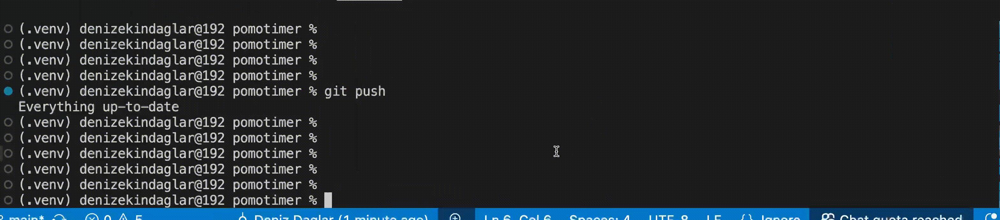

# Pomotimer

I built Pomotimer to track worktime without a browser.

## Why is it Useful?

- **No Distraction** No pop-ups, no ads, no bloat—just a clean CLI interface
- **Simple Visuals and Controls** See your progress in real time with a smooth, flicker-free progress bar
- **Persistence & Stats** Every session is logged in a JSONL file, so you can check how much you worked that day, week or month
- **Fully Customizable:** You can set your own work/break durations. Defaults exist too, for getting started faster.
- **Open Source and Extensible** Easy to fork, extend and integrate into your workflow.

## Demo



*Start, pause, resume, skip, and see your stats—all from your terminal!*

## Installation

1. **Clone the repository:**
   ```sh
   git clone https://github.com/yourusername/pomotimer.git
   cd pomotimer
   ```

2. **(Recommended) Create a virtual environment:**
   ```sh
   python3 -m venv venv
   source venv/bin/activate
   ```

3. **Install the package:**
   ```sh
   pip install .
   ```

---

## Usage

After installation, just run:

```sh
pomotimer
```

Or, from the project directory:

```sh
python -m pomotimer.main
```

Follow the prompts to start your focus session!

## Roadmap:

- [ ] Write unit and integration tests
- [ ] Try to make the input thread the main thread, and the time counting the side thread
- [ ] Basic notifications, terminal bell, break time/focustime
- [ ] Status prints current remaining time and state
- [ ] Show daily, weekly, monthly sessions completed, maybe show recommendations
- [ ] Optional integration with calendar or task managers

## 🤝 Contributing

Contributions, bug reports, and feature requests are welcome!
Feel free to open an issue or submit a pull request.
